 

## 👾 Sobre mim

Oi! Sou o **Erik**, Tecnólogo em Análise e Desenvolvimento de Sistemas pelo **Mackenzie** e estudante do **Técnico em Informática no Senac SP**. Nos projetos em equipe geralmente fico com o frontend, a interface e a integração entre as partes. Sou apaixonado por estética de games e pixel art 😄

<table>
<tr>
<td>

🎓 Tecnólogo em ADS pela Universidade Presbiteriana Mackenzie 
🏫 Técnico em Informática no Senac SP, estudando desenvolvimento mobile 
🛡️ Certificações Cisco em redes e cibersegurança 
🧭 Há 5 anos liderando equipe na Cobasi 
🔧 Monto, conserto e otimizo computadores 
🎬 Edito vídeos nas horas vagas 
💼 Em busca de oportunidades em <b>Suporte N1</b> e <b>NOC</b>, home office ou híbrido

</td>
</tr>
</table>

 

## 🛠️ Tecnologias

 

## 📜 Certificações Cisco

 

## 🚀 Projetos em destaque

<table>
<tr>
<th>Projeto</th>
<th>Sobre</th>
<th>Stack</th>
</tr>
<tr>
<td>🛡️ <a href="https://github.com/Erikfrvr/bioshield"><b>BioShield</b></a></td>
<td>App de saúde preventiva com QR Code de emergência, lembrete de medicamentos e modo cuidador. Projeto do Empreenda Senac 2026.</td>
<td><code>TypeScript · Express · MySQL</code></td>
</tr>
<tr>
<td>💈 <a href="https://github.com/Erikfrvr/BarbeariaApp"><b>BarbeariaApp</b></a></td>
<td>Sistema de agendamento e gerenciamento para barbearias, com interface em Flet e dados salvos em JSON.</td>
<td><code>Python · Flet</code></td>
</tr>
<tr>
<td>🏗️ <a href="https://github.com/Erikfrvr/projeto_sala"><b>projeto_sala</b></a></td>
<td>Backend construído em aula com a turma, organizado em camadas com DDD e Clean Architecture.</td>
<td><code>TypeScript · Node.js</code></td>
</tr>
<tr>
<td>🐾 <a href="https://github.com/Erikfrvr/sistema-cobasi"><b>Sistema Cobasi</b></a></td>
<td>Banco de dados relacional para caixa e programa de fidelidade, com modelagem entidade relacionamento.</td>
<td><code>MySQL</code></td>
</tr>
<tr>
<td>🌡️ <a href="https://github.com/Erikfrvr/MonitoramentoTemperatura"><b>MonitoramentoTemperatura</b></a></td>
<td>Monitoramento de temperatura e umidade.</td>
<td><code>C++</code></td>
</tr>
</table>

 

## 📊 Estatísticas

 

<picture>
<source media="(prefers-color-scheme: dark)" srcset="https://raw.githubusercontent.com/Erikfrvr/Erikfrvr/output/snake_dark.svg">
<source media="(prefers-color-scheme: light)" srcset="https://raw.githubusercontent.com/Erikfrvr/Erikfrvr/output/snake.svg">

</picture>

  

 

⭐ Valeu pela visita! Feito com pixel art e referências de JoJo.

